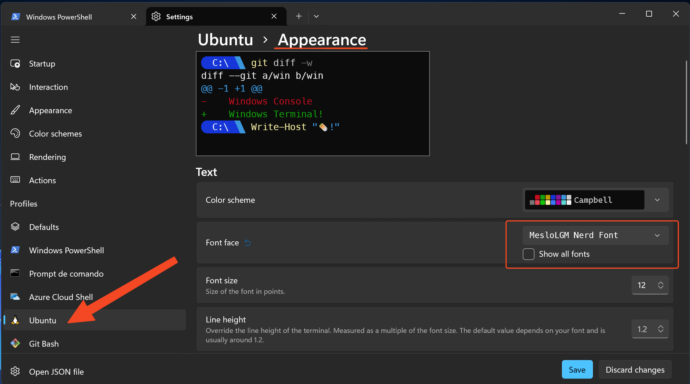

# My personal dotfiles

I use this repo to keeping my personal customization files that I use to personalize my terminal experience.

I got this idea from this video <https://www.youtube.com/watch?v=AK2JE2YsKto>, after that, I got a lot of more customizations.

> This can be applied on Linux, Mac or Windows (WSL).

## Install script

This script [.install.sh](.install.sh) can be used do the initial setup the tools (**zsh, oh-my-zsh, powerlevel10k theme, oh-my-zsh plugins, brew packages and yadm**), and then applies the YADM at the end, which gets the current customizations on your home directory `~/`.

### Download and execute the script
```bash 
curl -LO https://raw.githubusercontent.com/zenatuz/dotfiles/main/.install.sh
chmod +x .install.sh
./.install.sh
```

## Prompt

This is how your prompt will look like after cloning the settings with YADM.

- **Home directory**


- **Some project with git**


> To customize the prompt, run `p10k configure` or edit ~/.p10k.zsh.

## Getting the DOTFILEs, only

If you only want to get the files without installing anything new, just use YADM in your home directory.

```bash
cd ~
yadm clone git@github.com:zenatuz/dotfiles.git
```

## Brewfile

There is a way to easy install packages for both OSX and Linux using `brew` and `brewfile`, it's described on this link <https://gist.github.com/ChristopherA/a579274536aab36ea9966f301ff14f3f>

### Keep brewfile updated
Run this command to update the brew file based on what you are running.

```bash
brew bundle dump --file=.brewfile --force
```

### Install all the packages listed on the brewfile

```bash
 brew bundle install --file=.brewfile
```

## Font

To enjoy this setting at its utmost performance, install **MesloLGS NF** Font on your OS, and select `MesloLGS NF` on your Terminal and Code Editor.

> The font is already installed with brew for OSX. This install step is necessary only for Windows/WSL/Linux
> More info about MesloLGS font can be found on the repo: <https://github.com/romkatv/powerlevel10k#manual-font-installation>

### Windows

**Manual Install**

Follow instructions from <https://github.com/romkatv/powerlevel10k#manual-font-installation.

**Windows with powershell**

```powershell
choco install nerd-fonts-meslo
```

**MacOS with brew**

```brew
brew install --cask font-meslo-lg-nerd-font
```

### Configure the Font

#### **Windows Terminal**

On the terminal settings, click on the terminal you want to change the font (powershell/ubuntu/git bash, etc), go to **appearance**, then **Font face** and select `MesloLGM Nerd Font`.



#### **VSCode**

In the VSCode `settings.json` apply these settings to enable **`MesloLGS NF`** on the integrated terminal.

```json
    "terminal.integrated.fontFamily": "MesloLGS NF",
```


## Windows/WSL Additional Settings

It is possible to enforce some resource limitations on the WSL environment.

1 - Turn off all WSL instances such as docker-desktop

```powershell
wsl --shutdown
```

2 - Create/Edit the `.wslconfig` file with this content:

```powershell
notepad "%HOMEPATH%/.wslconfig"
```

```ini
[wsl2]
memory=4GB   # Limits VM memory in WSL 2 up to 4GB
processors=4 # Makes the WSL 2 VM use two virtual processors
```

More settings can be seen at the: [Official Documentation](https://docs.microsoft.com/en-us/windows/wsl/wsl-config#configure-global-options-with-wslconfig).
